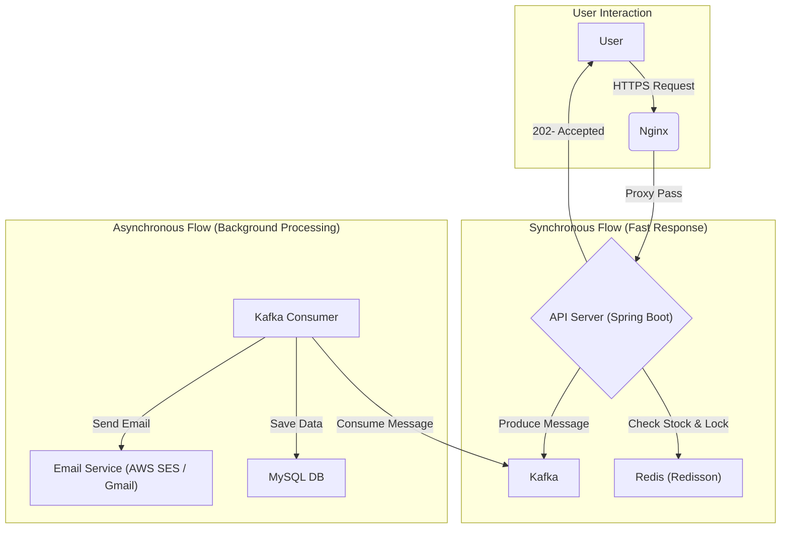

# Terning's Final Gift - Server

'터닝의 마지막 선물' 선착순 이벤트의 대규모 동시 접속 트래픽을 처리하기 위해 설계된 고성능 백엔드 서버입니다.

## 프로젝트 개요

이 서버는 이벤트 시작 순간에 발생하는 **Thundering Herd** 현상을 해결하는 것을 핵심 목표로 합니다. 비동기/이벤트 기반 아키텍처를 적용하여 수천 개의 동시 요청을 안정적으로 처리하고, Redisson 분산락과 Atomic 연산을 통해 제한된 수량의 상품에 대한 데이터 정합성을 보장합니다.

## 🏗아키텍처

사용자 요청은 빠른 초기 응답을 위한 동기 흐름과, 안정적인 데이터 처리를 위한 비동기 흐름으로 분리됩니다.

## 주요 기능

  * **대규모 동시성 제어**: 비동기 메시지 큐(Kafka)를 도입하여 대규모 트래픽을 안정적으로 수용하고 순차 처리합니다.
  * **데이터 정합성 보장**: `Redisson` 클라이언트를 활용한 분산 락으로 Race Condition을 방지하고, Redis의 Atomic 연산으로 재고를 정확하게 관리합니다.
  * **높은 테스트 신뢰도**: `Testcontainers`를 사용하여 실제 운영 환경과 동일한 외부 의존성(MySQL, Kafka, Redis)을 격리된 테스트 환경에서 구동하여 통합 테스트의 신뢰성을 극대화했습니다.
  * **실시간 모니터링**: `Spring Actuator`와 `Datadog` APM을 연동하여 애플리케이션의 상태와 성능을 실시간으로 추적합니다.

## 기술 스택

| Category | Stack |
| --- | --- |
| **Language** | Java 21 |
| **Framework** | Spring Boot 3.5.4, Spring Data JPA, Spring Security |
| **Database** | MySQL, H2 (for test) |
| **In-Memory Store** | Redis (with **Redisson** client) |
| **Message Queue** | Kafka |
| **Infra & DevOps** | AWS (EC2), Docker, Docker Compose, Nginx, Github Actions |
| **Testing** | JUnit5, **Testcontainers**, Spring Kafka Test, Awaitility |
| **Monitoring** | Datadog APM |

## API 명세

#### **1. 이메일 인증 코드 발송**

사용자의 이메일 주소로 6자리 인증 코드를 발송합니다.
`POST /api/auth/send-verification-code`

#### **2. 이메일 인증 코드 확인**

사용자가 입력한 인증 코드가 유효한지 검증합니다.
`POST /api/auth/verify-code`

#### **3. 선물 신청**

인증된 사용자가 선착순 이벤트에 참여를 신청합니다.
`POST /api/event/apply`

#### **4. 신청 상태 조회**

사용자 본인의 이벤트 신청 결과를 조회합니다.
`GET /api/event/status`

#### **5. (관리자) 이벤트 재고 설정**

관리자가 이벤트 시작 전, 총 선물 재고 수량을 설정합니다.
`POST /api/admin/event/stock`
